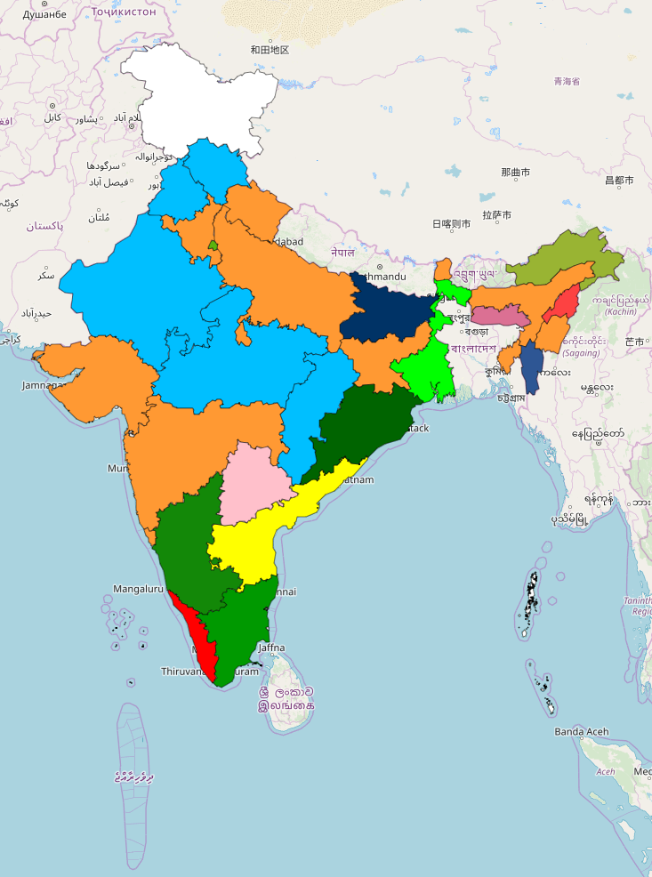

# Visualize ruling party history in India per state
A Project to Visualize history of election results in India on Map. 

## Installation

This is a **Python 3.6** module that depends on the **Folium** **Pandas** and **GeoPandas** packages.

1. Clone and `cd` into this repo.
2. Install **Python 3.6**.
3. Install requirements from pip with `python3 -m pip install -r requirements.txt`.
4. Test the program by running `VisualizeRulingPartyHistory.py` 

## Usage
Just run `VisualizeRulingPartyHistory.py` file. The output will be a html file `ruling_political_party_in_india.html` under `\maps` folder. 

### Data
All data used in this example is sourced from internet.
* **Shape Files**
    * https://indiamaps.gov.in/soiapp/
* **Historical Election Results**
    * http://www.elections.in/previous-election-results.html

### Map
This is the output of the project. Please refer the below [wikipedia](https://en.wikipedia.org/wiki/Category:India_political_party_colour_templates) page to determine the color code

### Disclaimer
All data used in this example is sourced from internet. The Author does not take guarantee of accuracy.  
